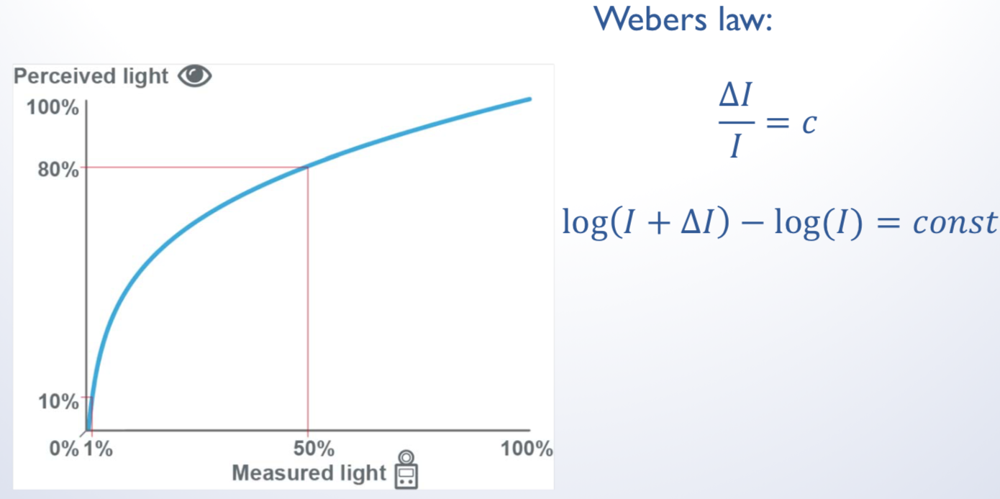
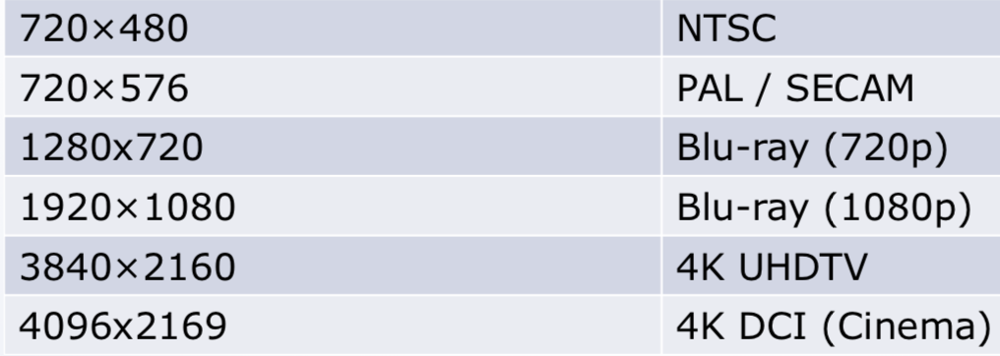
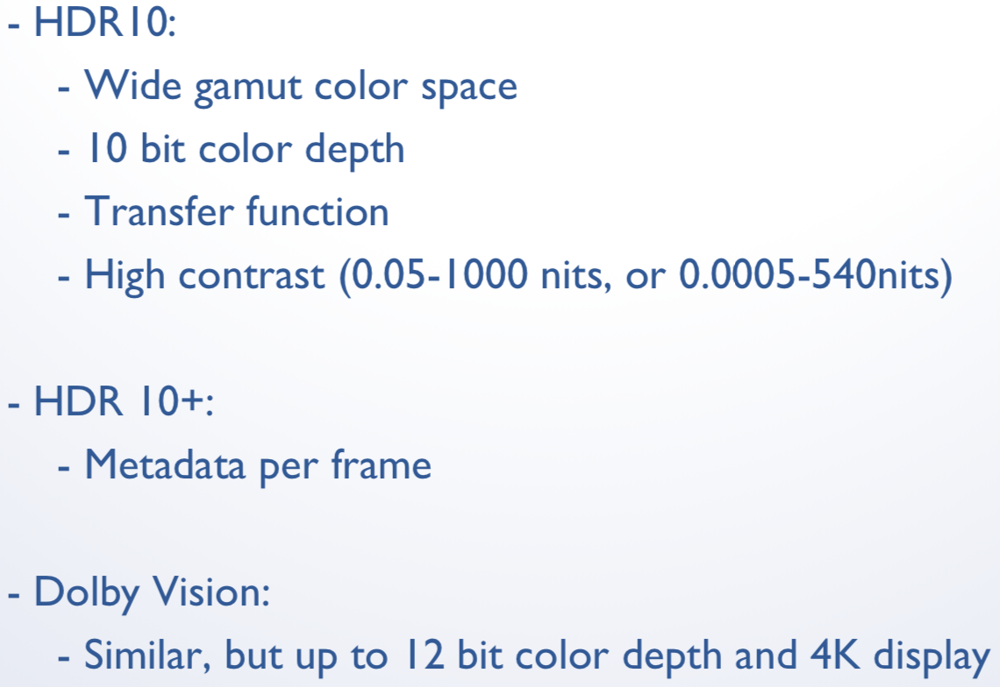

# Farbe

## ToDo
* Week 1

## Was ist Farbe

## Composite Video (YUV)
Y: Helligkeit
UV: Farbkodierung, häufig mit 1/4 der Auflösung

Y = 0.299*R + 0.587*G + 0.114*B
U = 0.436*(B - Y) / (1 - 0.114)
V = 0.615*(R - Y) / (1 - 0.299)

## Helligkeits / Kontrast Wahrnehmung

Beispiel nits:

100nits zu 150nits (+50, faktor 1.5)
10nits zu 60nits (+50, faktor 6)

## Resolutions

## HDR
Mehrere Aufnahmen mit verschiedenen Einstellungen - Bilder werden anschliesend zusammengesetzt.

## Farbraum
REC2020 für HDR (grösser als sRGB oder Adobe RGB)

## Links
* Color Matters
    
    http://www.colormatters.com

* Educational Color Applets
    
    http://www.cs.rit.edu/~ncs/color/

* Color glossary:                                        
    http://www.cs.rit.edu/~ncs/color/glossary.htm

* Online book on color
    
    http://www.colorvoodoo.com/cvoodoo4.html

* Map Coloring
    
    http://www.personal.psu.edu/faculty/c/a/cab38/

* Get your own color cube!!!
    
    http://www.colorcube.com/intro.htm

* LED
    
    http://www.youtube.com/watch?v=jiejNAUwcQ8
    
    http://uk.businessinsider.com/these-amazing-gifs-show-exactly-how-a-led-display-works-2015-3?r=US&IR=T
