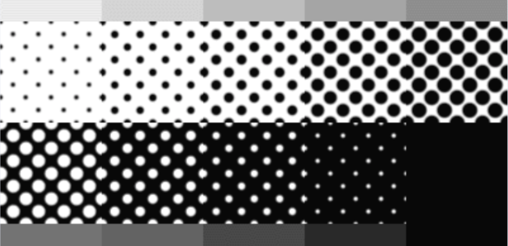
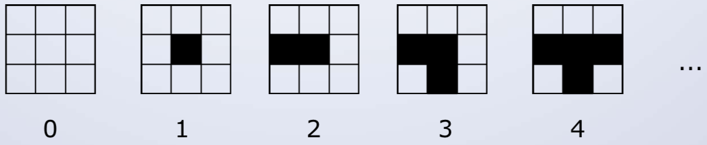
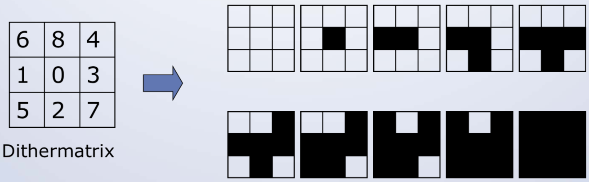
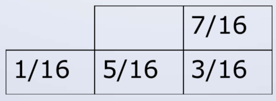

# Farbe2

## Halbtontechnik (Drucker)
Verfahren:
* Quantisierung
* Dithering
* Error Diffusion

Drucker haben weniger Farbstufen aber eine höhere Auflöstung (bsp: 55" TV hat 40dpi, normaler Drucker hat 300-1200dpi).
Mittels Dithering werden Farben mit Auflösung "simuliert"

Amplituden-Verfahren für Grautöne:
Der Anteil der schwarzen und weissen Flächen enspricht dabe dem Grauwert

## Digitale Halbtontechnik
Je nach Grauwert werden die Pixel gesetzt

## Dithermatrix
Die Matrix gibt an, ab welcher Stufe ein Pixel gesetzt wird

## Dithering bei gleichbleibender Bildgrösse

2 Methoden:
* Berechnen des Mittelwert einer n x n Region und       ersetzen der Region durch die Dithermatrix ->        Clustered dot dithering

* Vergleich der einzelnen Pixel mit den Werten der      Dithermatrix -> Dispersed dot dithering

### Clustered Dot Dithering
Mittelwert einer n * n Region. Wird mit Dithermatrix ersetzt

### Disperesed Dot dithering

* Es sei Dij der Wert der Dithermatrix, und 
    i = x modulo n
    j = y modulo n

* der Pixel x,y wird gesetzt, falls
    I(x,y) > Dij

## Error Diffusion
Frequenz Verfahren - Punkte werden verschieden dicht angeordnet

Idee:
* Der Fehler der durch das Setzen eines Pixels auf      schwarz oder weiss gemacht wird, wird auf die        umliegenden Pixel verteilt.

* Das Bild wird dabei sequentiell von oben nach         unten und von links nach rechts durchlaufen.

* Der Fehler wird anhand der folgenden Gewichte auf     die noch nicht besuchten Pixel verteilt

Übung:

