# Projektive Geometrie 1

## Addition
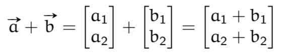

## Multiplikation mit Skalar
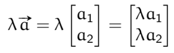

## Inverses
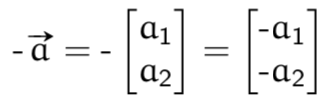

## Nullvektor
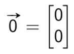

## Substraktion
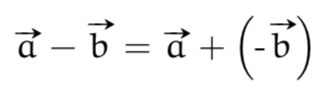

## Gleiche Vektoren
Zwei Vektoren sind gleich, wenn ihre Komponenten gleich sind!

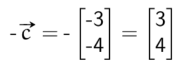

## Kartesisches Koordinatensystem
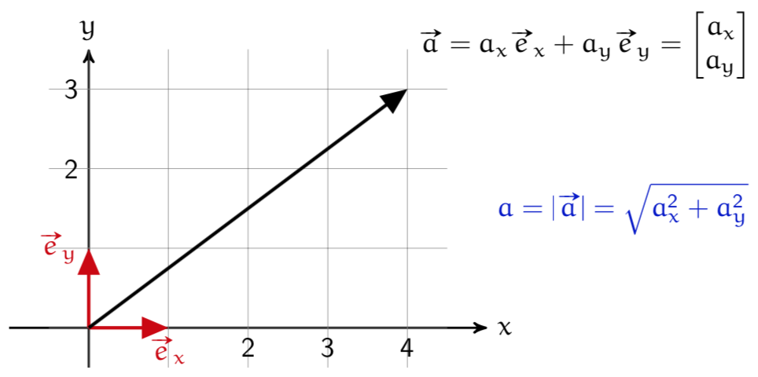

## Rechenregeln
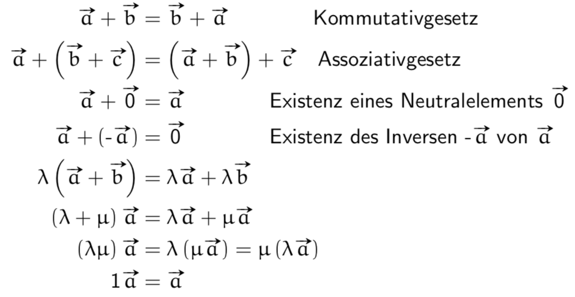

## Skalarprodukt
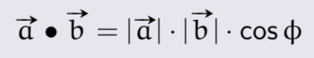

## Beliebige Koordinaten
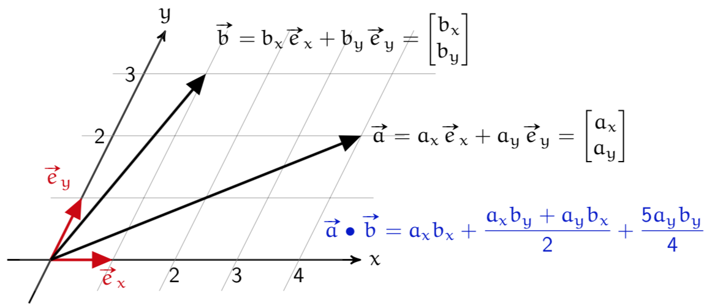

## Skalarprodukt in beliebigen Koordinaten
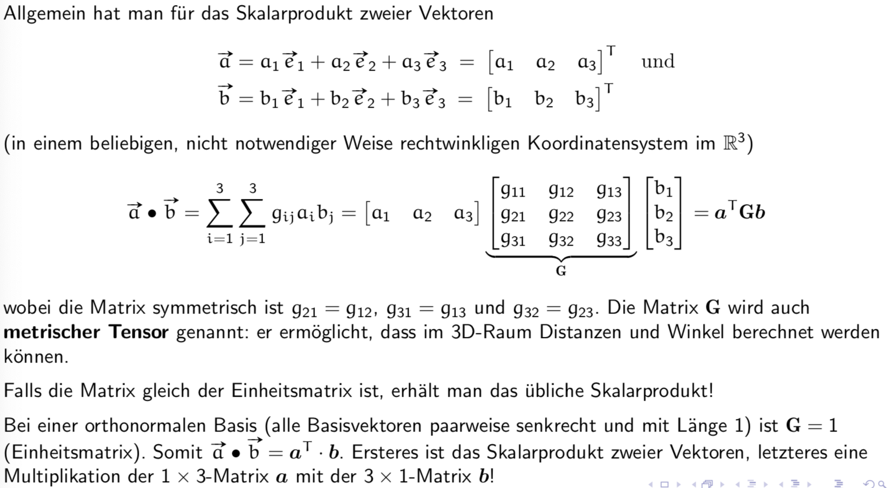

## Rechenregeln für das Sklaraprodukt 
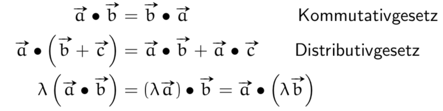

## Der Betrag (oder die Länge) eines Vektors
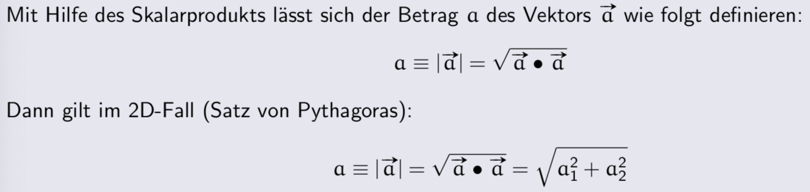
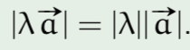

## Orthogonale Vektoren
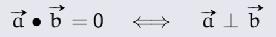

## Lineare Unabhängigkeit von Vektoren
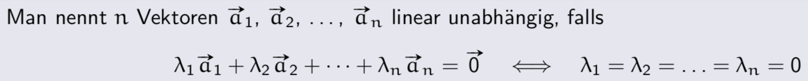

## Beschreibung von geraden, 2D & 3D
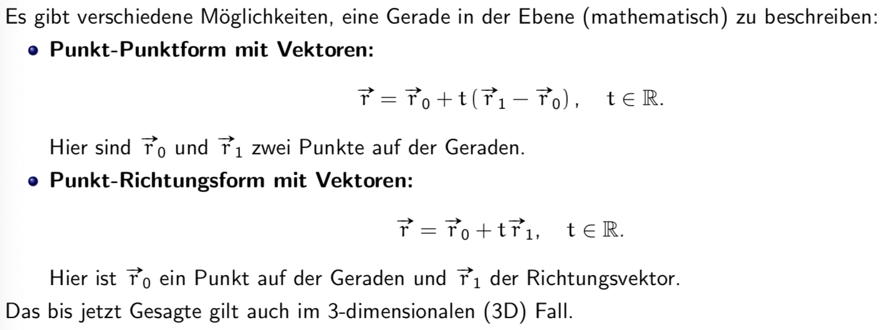
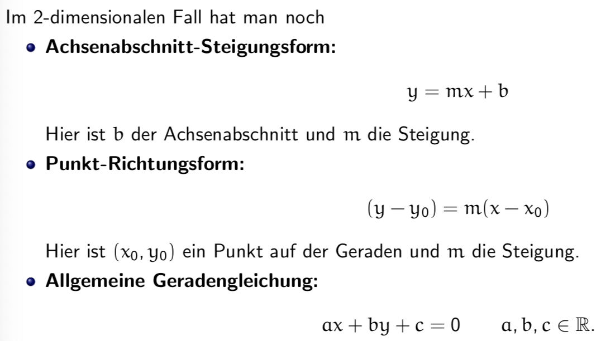

## Die Hessesche Normalform (HNF) der Geraden
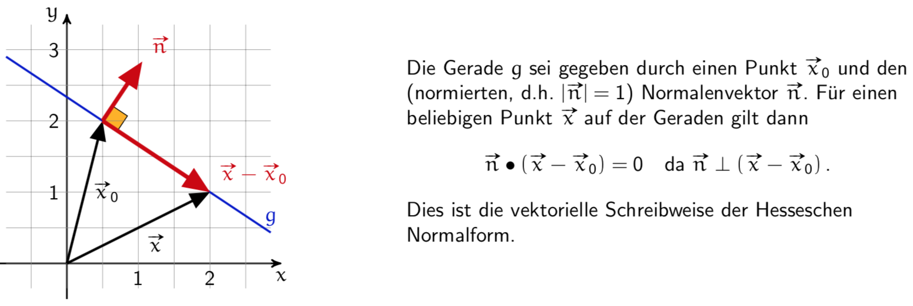

Zusammenhang HNF und Beschreibung von geraden:
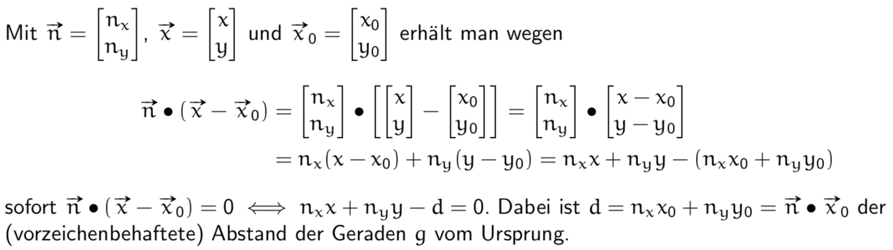

## Positive Halbebene (+HE) / Negative Halbebene (-HE)
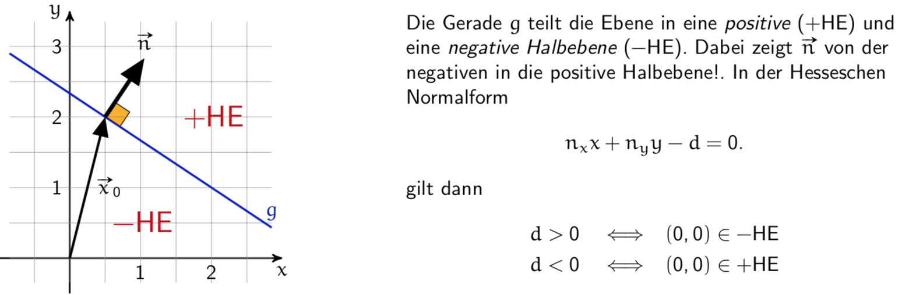

* Normalenvektor zeigt in die positive Halbebene
* d ohne Vorzeichen!
* d zeigt wo der Ursprung ist
    * d < 0 dann ist der Ursprung in +HE
    * d > 0 dann ist der Ursprung in -HE

## Von der Koordinatengleichung zur HNF
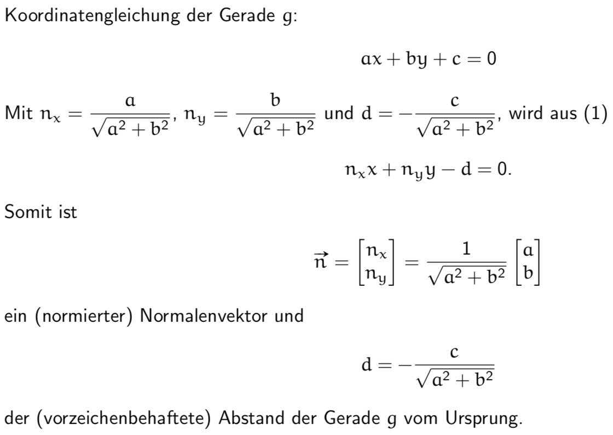

## Von der Koordinatengleichung zur HNF (Ebene)

## Projektion des Vektors
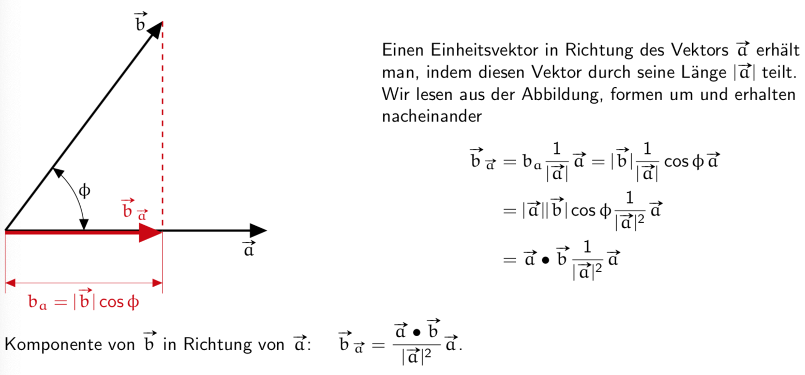

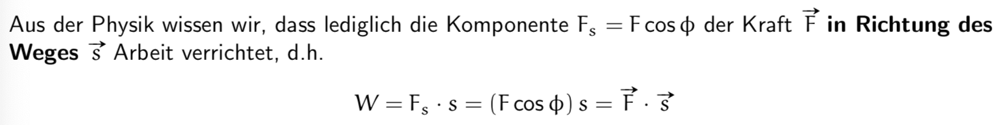

## Das Vektorprodukt

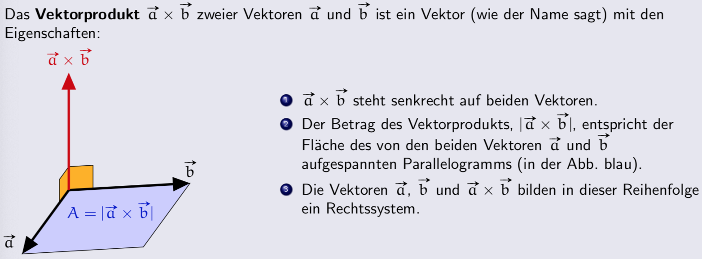

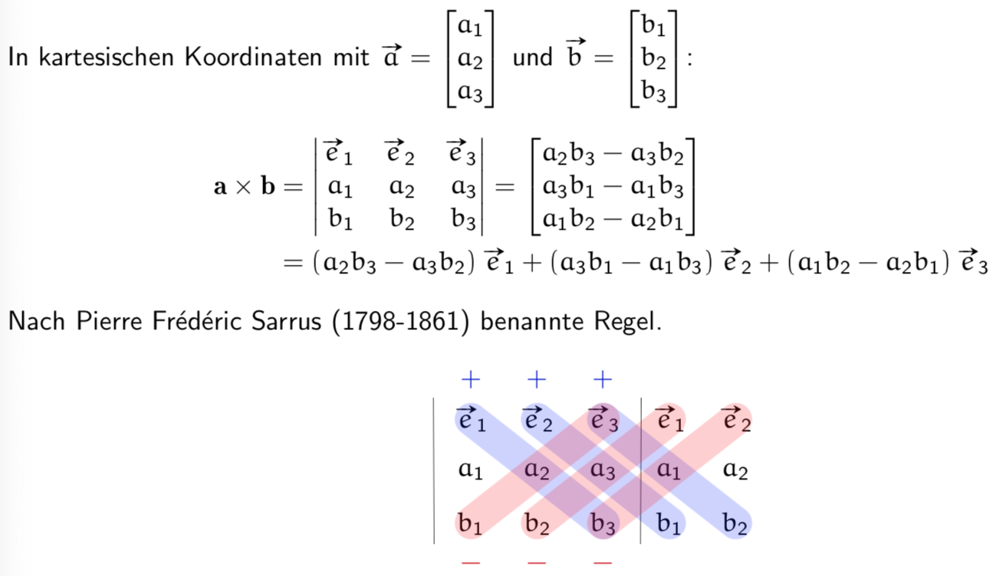

## Das Vektorprodukt Anwendungen

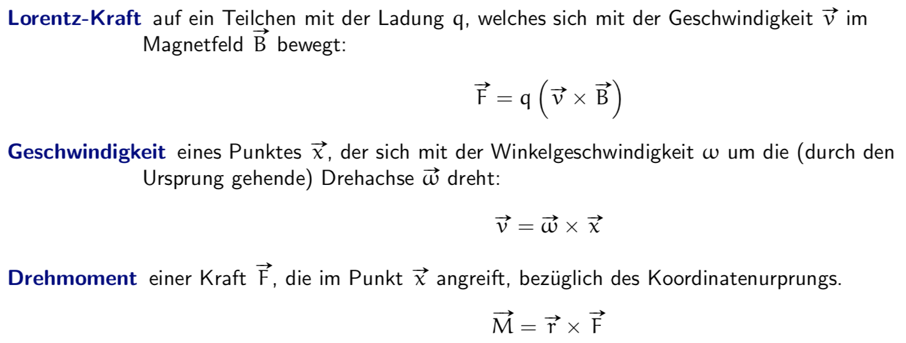
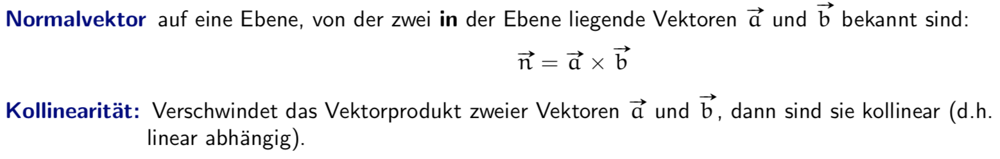

## Rechenregeln für das Vektorprodukt

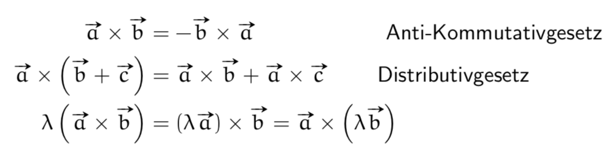

## Spatprodukt
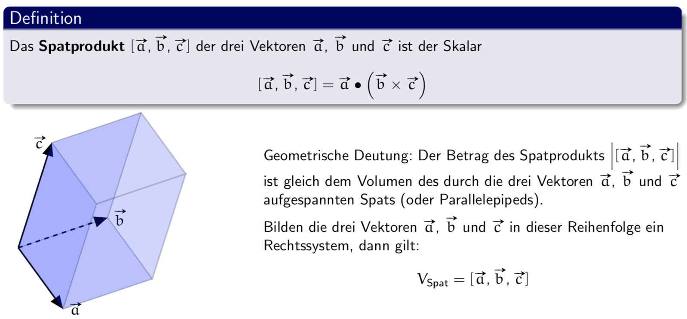

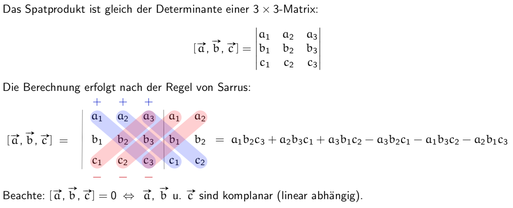

## Rechenregeln für das Spatprodukt

## Translation - wir behandeln nur den 2D-Fall
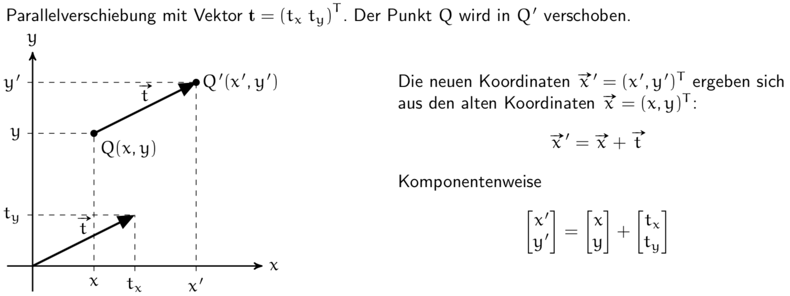

## Skalierung 2D
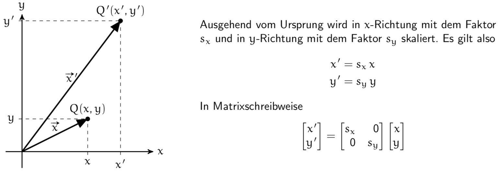

## Rotation 2D
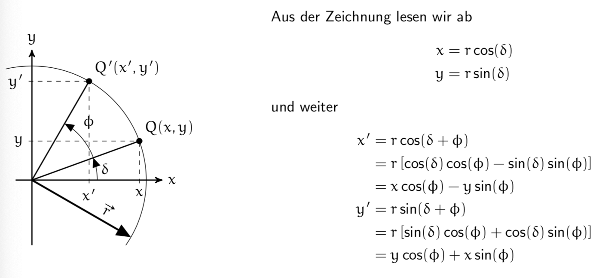

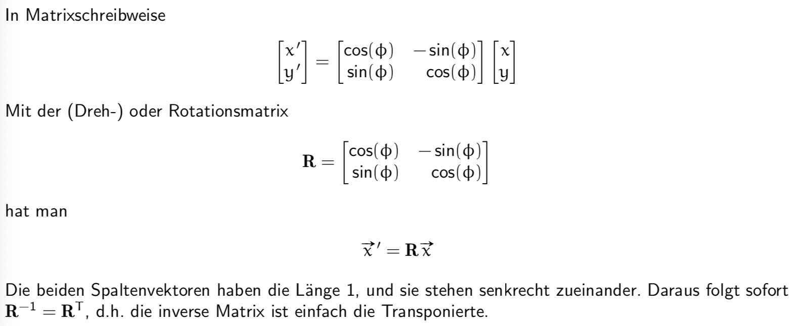

