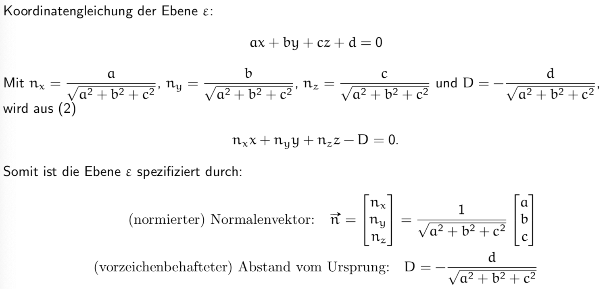
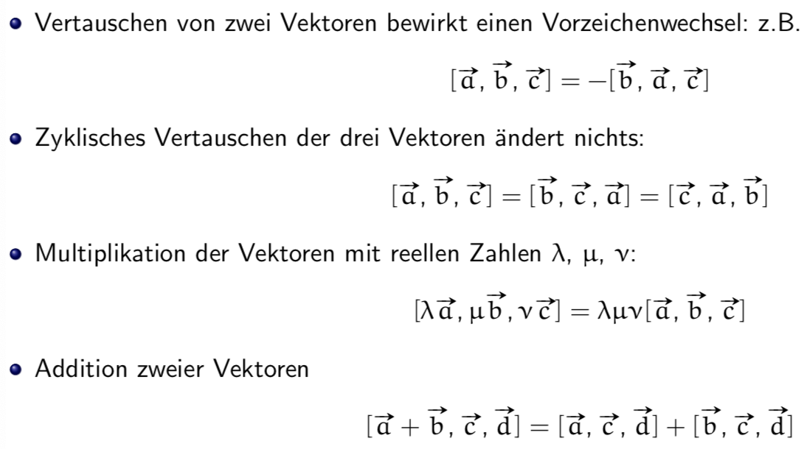

# Projektive Geometrie 1

## Addition

## Multiplikation mit Skalar

## Inverses

## Nullvektor

## Substraktion

## Gleiche Vektoren
Zwei Vektoren sind gleich, wenn ihre Komponenten gleich sind!

## Kartesisches Koordinatensystem

## Rechenregeln

## Skalarprodukt

## Beliebige Koordinaten

## Skalarprodukt in beliebigen Koordinaten

## Rechenregeln für das Sklaraprodukt 

## Der Betrag (oder die Länge) eines Vektors

## Orthogonale Vektoren

## Lineare Unabhängigkeit von Vektoren

## Beschreibung von geraden, 2D & 3D

## Die Hessesche Normalform (HNF) der Geraden

Zusammenhang HNF und Beschreibung von geraden:

## Positive Halbebene (+HE) / Negative Halbebene (-HE)

* Normalenvektor zeigt in die positive Halbebene
* d ohne Vorzeichen!
* d zeigt wo der Ursprung ist
    * d < 0 dann ist der Ursprung in +HE
    * d > 0 dann ist der Ursprung in -HE

## Von der Koordinatengleichung zur HNF

## Von der Koordinatengleichung zur HNF (Ebene)

## Projektion des Vektors

## Das Vektorprodukt

## Das Vektorprodukt Anwendungen

## Rechenregeln für das Vektorprodukt

## Spatprodukt

## Rechenregeln für das Spatprodukt

## Translation - wir behandeln nur den 2D-Fall

## Skalierung 2D

## Rotation 2D

