# Projektive Geometrie 2

## Punkte und Geraden
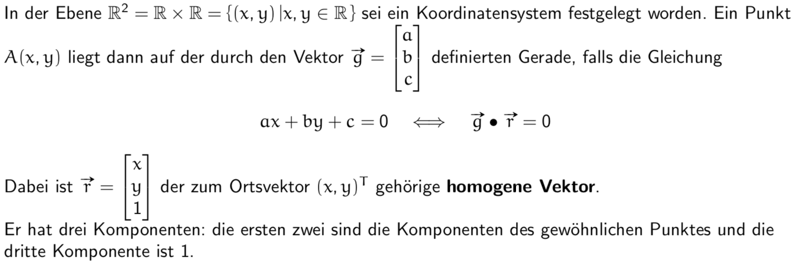

### Beispiel Parallel Geraden
De-Homogenisierung nicht möglich weil die letzte Komponente 0 ist (division nicht möglich)

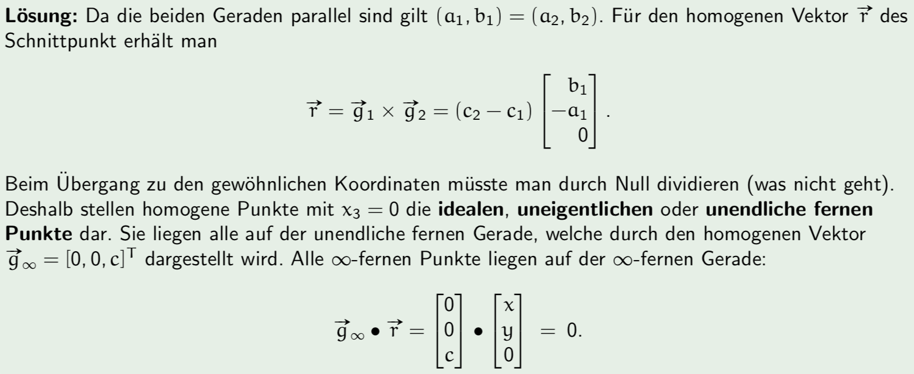

## Projektive Ebene
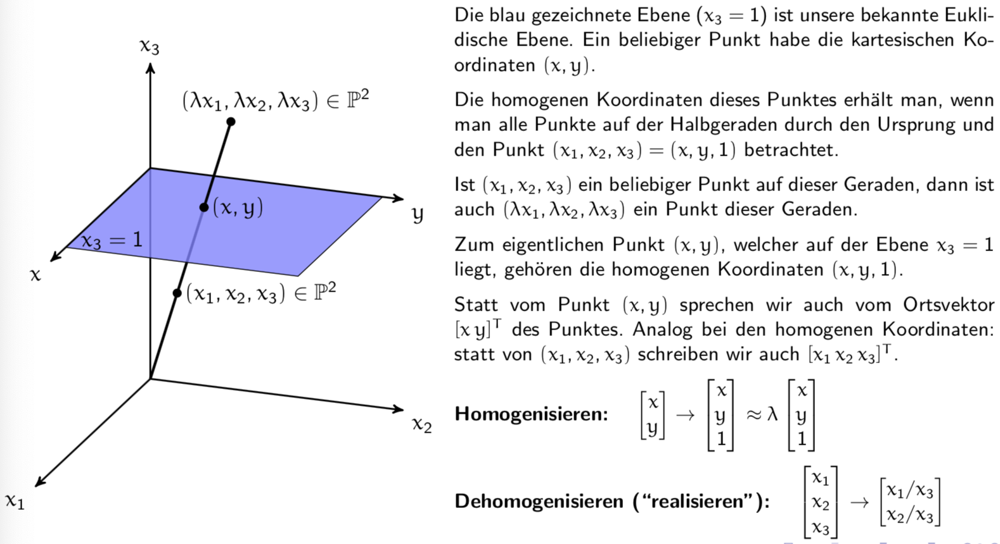

## Projektive Transformationen

## Projektion zwischen zwei parallelen Ebenen
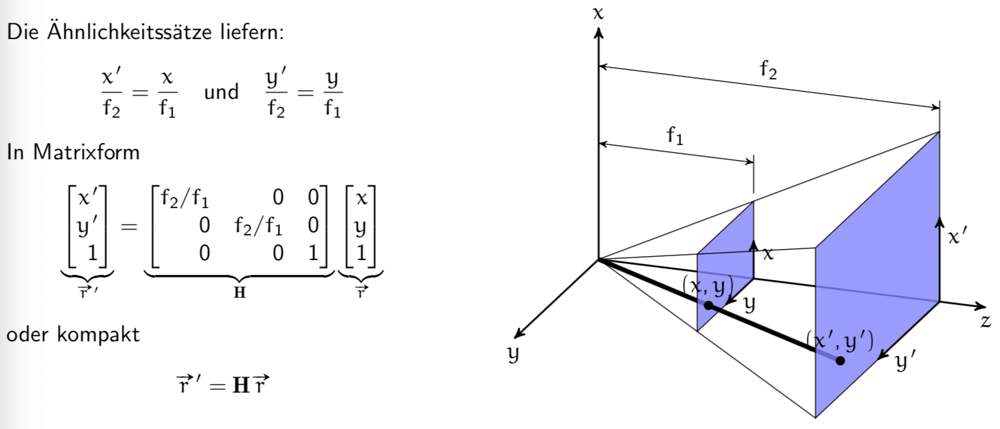

## Zusammensetzen von projektive Transformationen
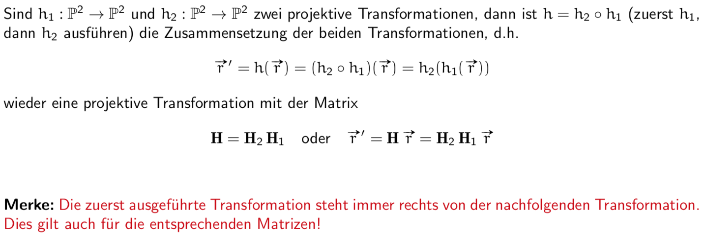

## Einteilung der projektiven Transformationen

* Translation
* Drehung um den Nullpunkt um einen Winkel phi
* Spiegelung an einer Geraden durch den Nullpunkt
* Zusammensetzungen davon

### Translation um den Vektor
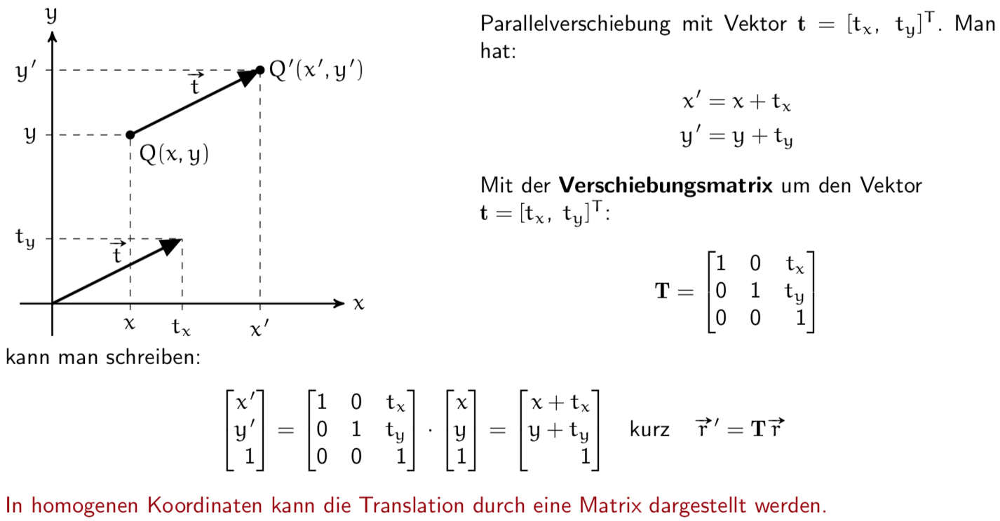

### Rotation um den Nullpunkt um den Winkel phi
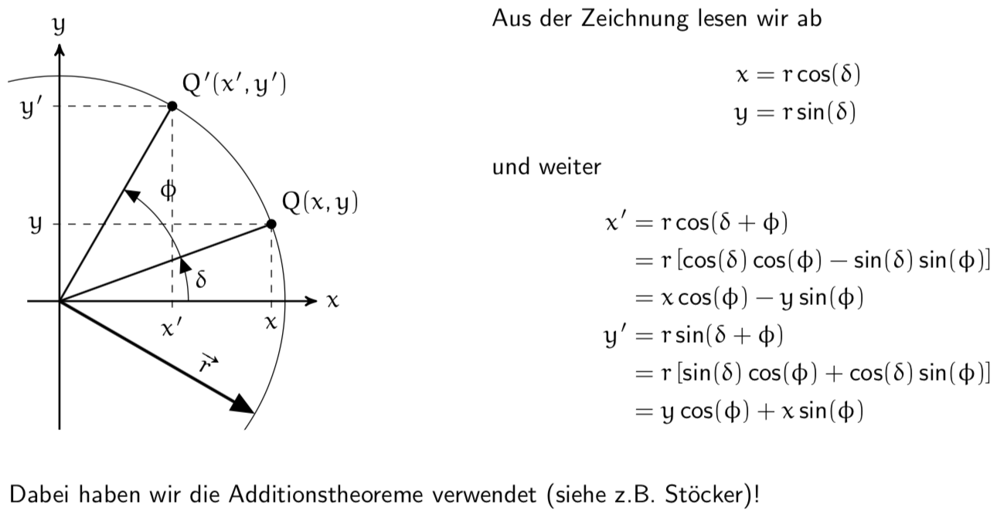

Beispiel:
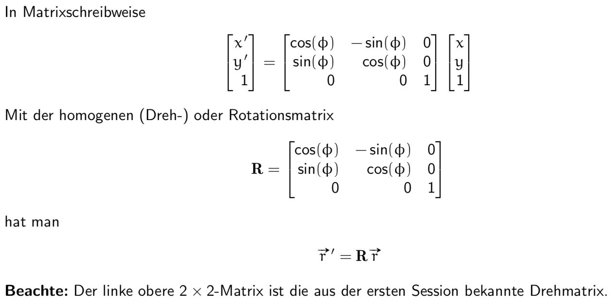

### Spiegelung an einer Geraden g durch den Ursprung
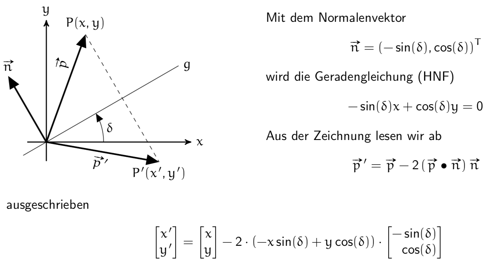

Beispiel:

### Rotation um den Punkt A um den Winkel phi
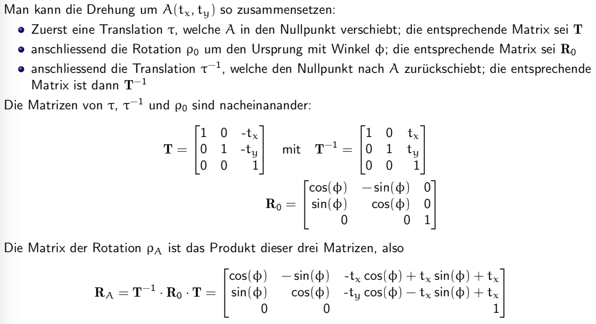

### Ähnlichkeiten (Streckung)
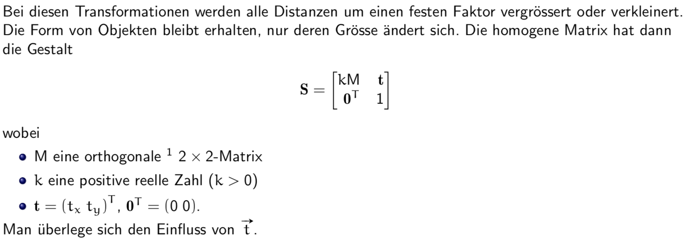

### Affine Transformationen
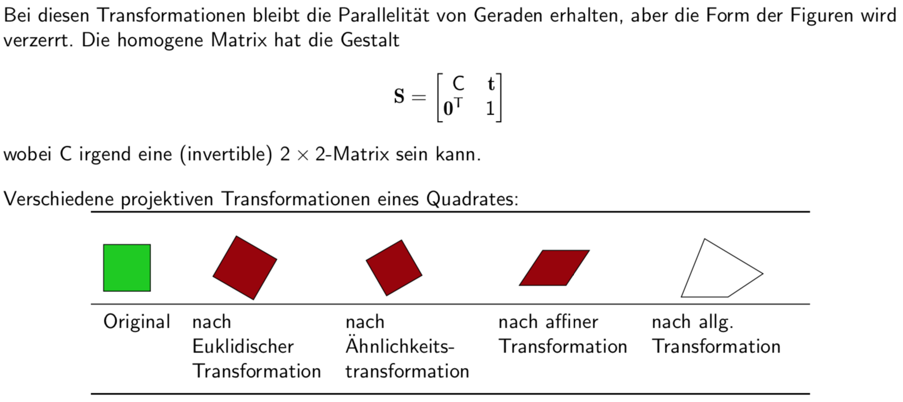

## Zusammenfassung
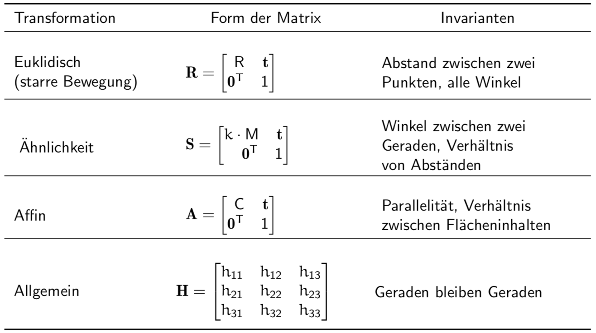