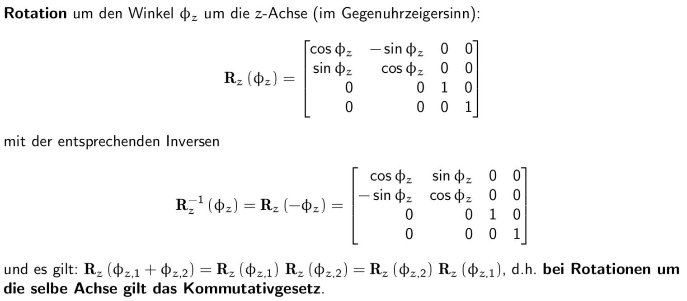

# Projektive Geometrie 3

## Transformation des Koordinatensystems

## Die homgenen Koordinaten eines Raumpunktes

## Ebene im Raum

## Projektive Abbildungen

## Euklidisch (starre Bewegung)
R -> 3x3 Matrix (orthogonale Matrix, inverse ist Transponierte Matrix)
t -> Vektor
0^t -> 3 mal 0

### Ähnlichkeit
k ist eine konstante
M ist wieder eine orthogonale Matrix

### Affin
C -> 3x3 Matrix, C^-1 muss existieren (Invertierbar)

## Translation & Rotation

### Translation

### Rotationen um die z-Achse

### Rotationen um die y-Achse

### Rotationen um die x-Achse

### Rotationen um eine beliebige Achse

### Alternative Form der Rotation um eine Achse durch den Ursprung

## Projektionen

### Parallele Projektion

### Perspektivische Projektion

