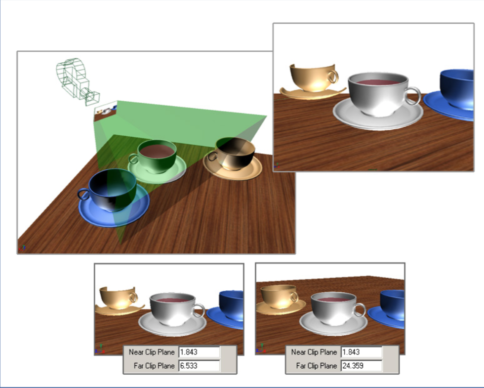
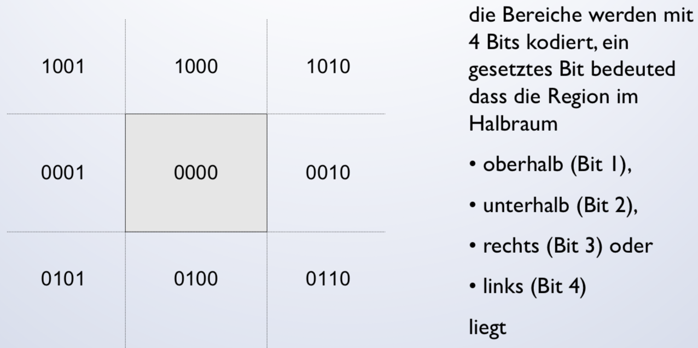
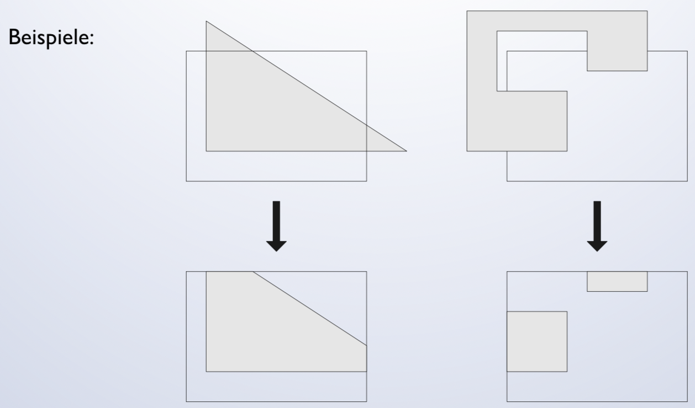
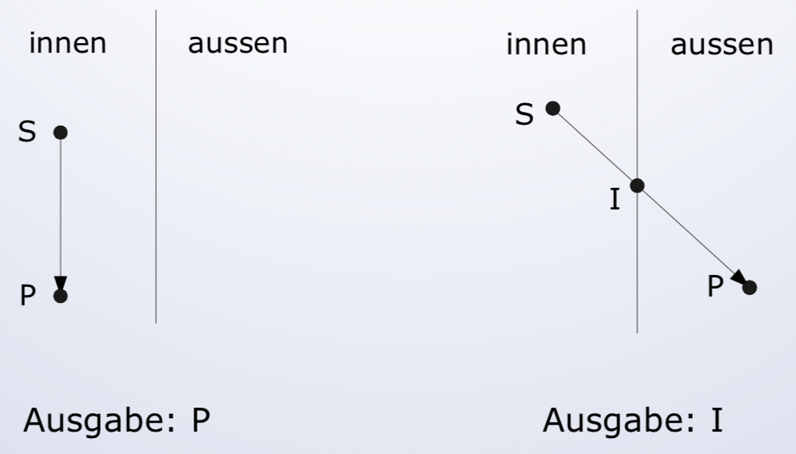
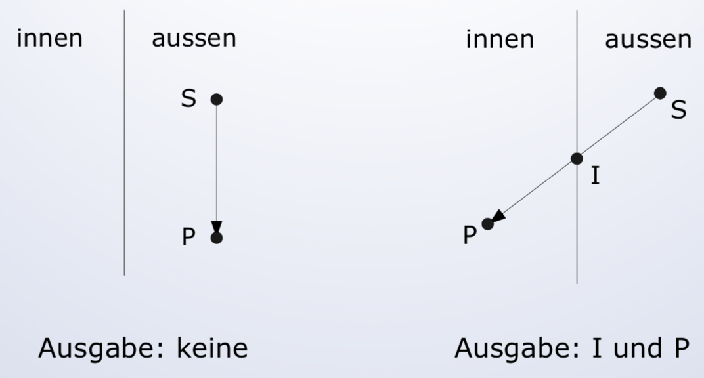

# Clipping

## 2D
Die zu zeichnenden Grafikobjekte werden typischerweise in einem Bereich spezifiziert der grösser als das dargestellte Fenster ist.

## 3D
Objekte die sich ausserhalb des Viewing Bereichs befinden, müssen nicht mehr weiterverarbeitet werden:
* Vermeidung von unnötiger Rasterisierung
* Vermeidung von Rechenproblemen bei sehr grossen z-Koordinaten

## Verfahren
Scissering
* Es werden alle Pixel berechnet, aber nur diejenigen gezeichnet die im Fenster liegen.
Temporärer Buffer
* Das ganze Object wird in einem temporären Buffer gezeichnet
* Der Buffer wird kopiert
Analytische Berechnung derjenigen Teile, die im Inneren des Fensters liegen

## Clipping von Linien
Gegeben sei ein Kappungsrechteck und die Endpunkte der zu zeichnenden Linie

**Brute Force Algorithmus:**
* Berechnung aller Schnittpunkte der Linie mit dem Kappungsrechteck falls mindestens ein Endpunkt der Linie ausserhalb des Rechtecks liegen

**Cohen-Sutherland:**
1. Die ganze Ebene wird in Bereiche unterteilt
2. Durch Vergleichen der Bereiche in denen die Endpunkte liegen, wird entschieden ob die Linie einfach akzeptiert oder abgelehnt werden kann
3. Ist dies nicht der Fall, wird die Linie in zwei Teile geteilt, wovon eines abgelehnt wird, mit dem anderen wird zu Schritt 2 zurückgekehrt

## Bereichunterteilung

## Einfaches Ablehnen oder Akzeptieren der Linie
* Akzeptieren: Die Linie wir akzeptiert wenn beide Endpunkte im Kappungsrechteck liegen

* Ablehnen: Die Linie wird abgelehnt, wenn beide Endpunkte in einem gemeinsamen Halbraum liegen, also wird geprüft ob **Code(x0,y0) AND Code(x1,y1) != 0** wobei AND den bitweisen UND Operator bezeichnet

## Clipping von Polygonen
1. Unterschiedlich zu Linien-Clipping,
2. Das entstehende Polygon kann mehr oder weniger Eckpunkte als das Eingabe Polygon haben

## Algorithmus von Sutherland-Hodgeman
* Algorithmus zum Clipping von Polygonen an einer Geraden.
* Zum Clipping an einem Rechteck wird er mehrmals angewendet
* Parallele Implementation möglich (Reentrant Polygon Clipping)

## Ablauf
* Betrachtet wird jeweils der aktuelle Punkt S, sowie der nächste Punkt P
* 4 Konfigurationen von S und P sind möglich
* Je nach Konfiguration werden 0-2 Eckpunkte des neuen Polygons “ausgegeben”

