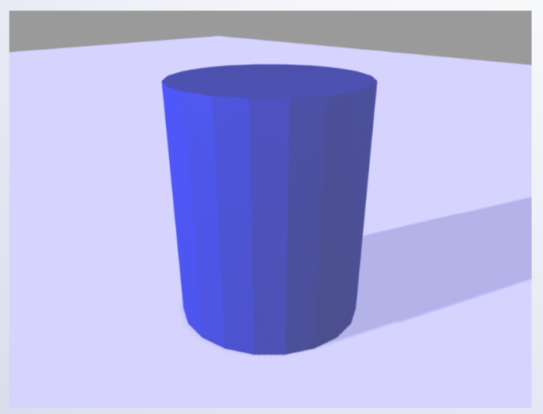

# Shading

## Material Eigenschaften
* Spiegelung
* Glanz / Matt
* Transparenz
* Glatt, Rau
* Farbe
* Struktur / Textur
* Brechung
* Anisotrop

## Standardbeleuchtungsmodell
* Ein physikalisch korrektes Beleuchtungsmodell ist relativ aufwendig zu berechnen (auschlaggebend sind die sogenannten Fresnel-Gleichungen aus der Physik)
* Üblicherweise wird deshalb - vor allem für interaktive Programme - ein vereinfachtes Beleuchtungsmodell verwendet
* Das Modell simuliert diffuse und spiegelnde Reflektion
* Raytracing und Radiosity verwenden zum Teil aufwendigere Beleuchtungsmodelle

## Diffuse Reflektion (Lambert Modell)

* Gleichmässige Abstrahlung des Lichts in alle Richtungen
* Eigenschaften eines matten, nicht glänzenden Materials

## Energie

* Die Energie einer beleuchteten Fläche ist proportional zum Cosinus zwischen Lichtrichtung und Flächennormalen

## Berechnung der diffusen reflektion

**Term für die diffuse Reflektion**

**mit**

**wobei**
* N -> die Flächennormale
* L -> die Richtung zur Lichtquelle
* Id -> die reflektierte Intensität
* Il -> die Intensität der Lichtquelle bezeichnet

## Spiegelnde Reflektion

* Simulation der Spiegelung auf glänzenden Oberflächen wie Plastik, Metall oder lackiertes Holz

## Phong Modell
* Die Intensität des Lichts nimmt mit cosnf ab, wobei f der Winkel zwischen der idealen Reflektionsrichtung und der betrachteten Richtung ist.

## Berechnung der Reflektionsrichtung

## Phong Koeffizient

## Scattering

## Modell

## Farbe
* Die Reflektionskonstanten kd und ks hängen von der Wellenlänge ab.
* Im einfachen Beleuchtungsmodell werden sie durch Konstanten für die Farben rot, grün und blau bestimmt.
* Beispiel: rotes Objekt aus Plastik:
    * kd = (0.6, 0, 0)
    * ks = (0.35, 0.35, 0.35)

## Abschwächung des Lichts
* Die Energie des Lichts nimmt mit dem Quadrat des Abstands ab, dadurch werden die Objekte allerdings schnell zu dunkel
* Häufig findet deshalb das folgende, flexiblere Modell Verwendung

## Lichtquellen

## Schattierung
* Die Schattierung bestimmt an welchen Orten die Beleuchtung berechnet wird
* Man unterscheidet zwischen
    * Konstanter Schattierung
    * Gouraud Schattierung
    * Phong Schattierung

## Konstante Schattierung

* pro Polygon wird nur eine Farbe berechnet
* Eignet sich nicht für gekrümmte Objekte

## Gouraud Schattierung

* Berechnung der Farbe an jedem Eckpunkt des Polygons
* Lineare Interpolation der Farbe im Innern des Polygons

## Phong Schattierung

* Interpolation des Normalenvektors im Innern des Polygons
* Beleuchtungsberechnung für jeden Pixel