# Rendering Equations
## BRDF
Bidirectional Reflectance Distribution Function
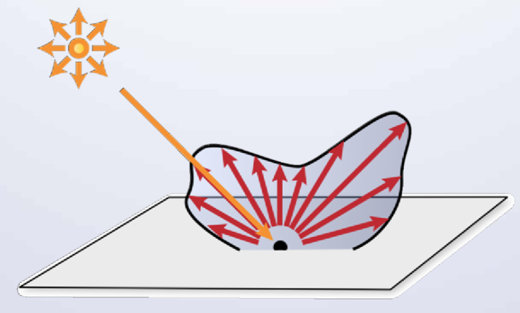

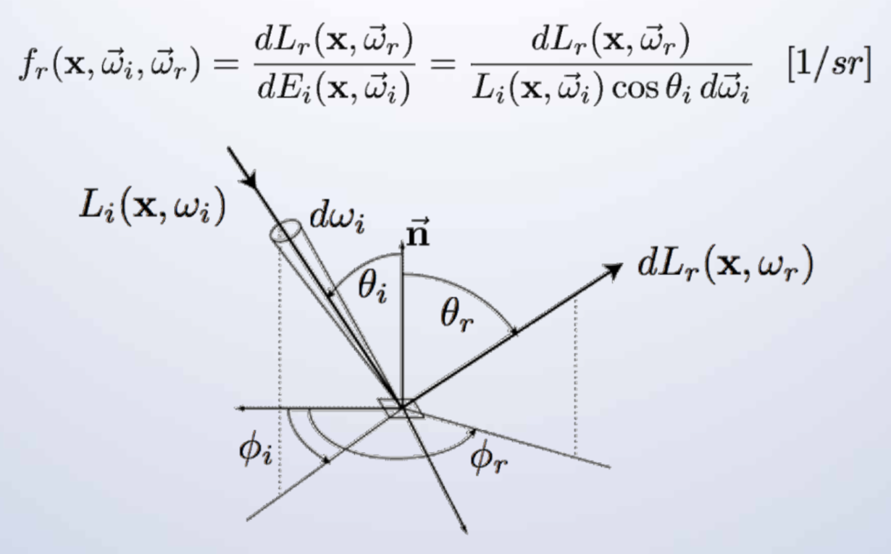

## Rendering Equation
1. Step
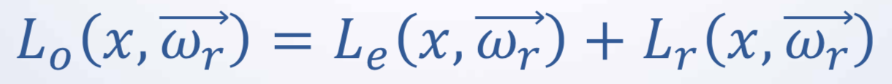

Le = Light emitted
Lr = Light reflected

2. Step
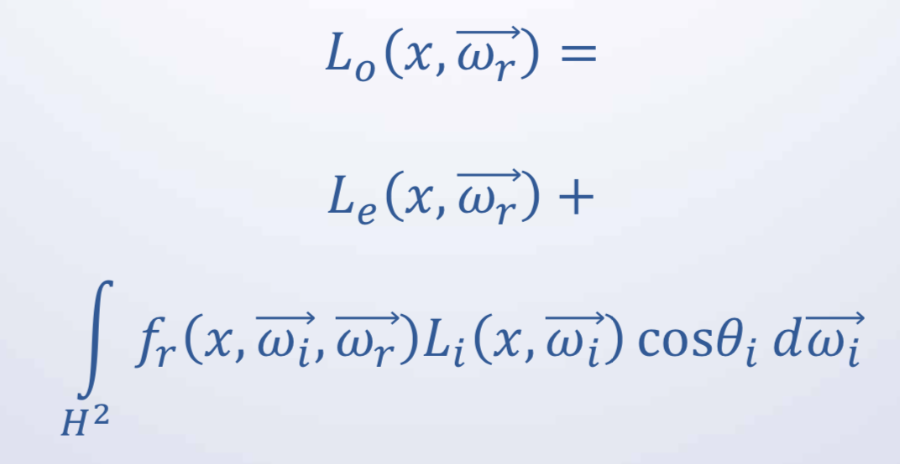
Integral describes sphere (see Direct Illumination)

## Direct Illumination
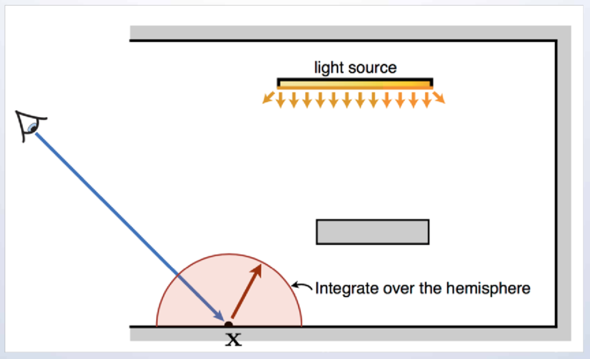

## Indirect Illumination
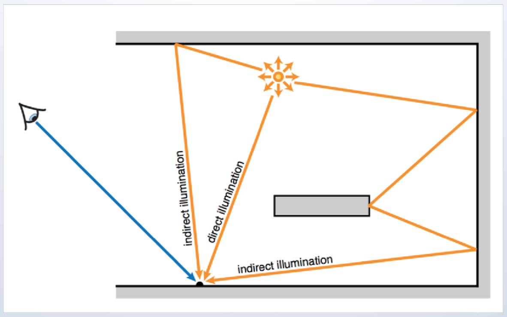

## Radiosity Konzept
* Die Oberflächen der Objekte werden in „Patches“ unterteilt
* Ein „Patch“ ist ein Polygon mit konstanten Licht Intensität
* Der Licht Transfer zwischen den Patches wird durch ein System von lineraren Gleichungen modelliert.
* Durch Lösung der Gleichungen wird die Intensität und Farbe pro Patch berechnet.

## Radiosity Gleichung
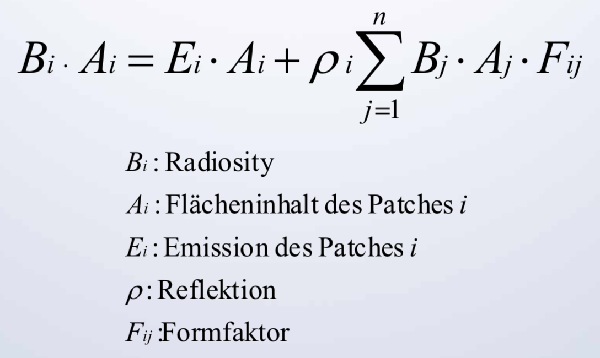

## Formfaktoren
Anteil der Energie der von Patch i auf Patch j trifft
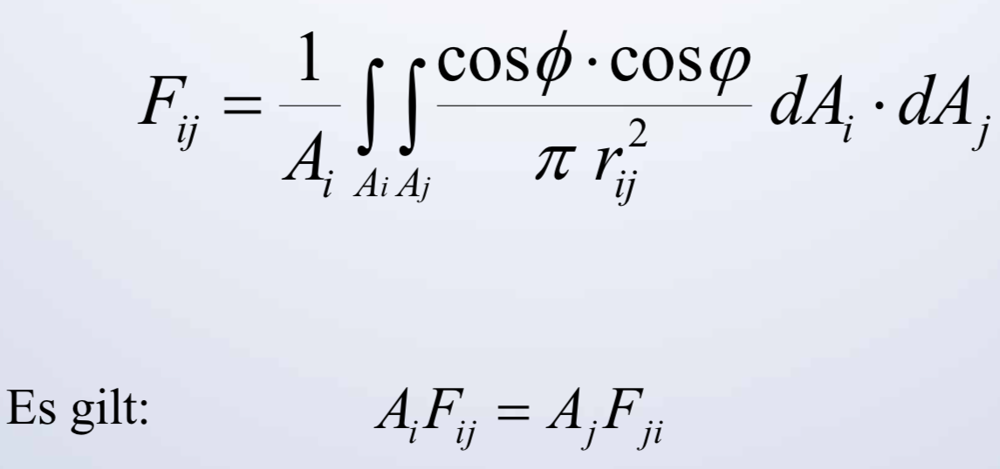

## Gleichungssystem
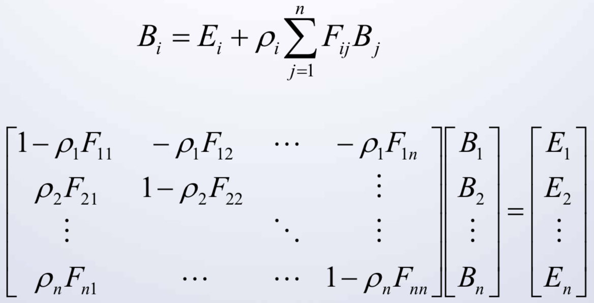

## Lösung des Gleichungssystem

* Standardtechniken:
    * Jacobi Iteration
    * Gauss Seidel Relaxation
    * Southwell Iteration

* Aufwendig! (n^3)

## Berechnung der Formfaktoren
* Probleme:
    * Analytische Berechnung des Integrals geht nur in Ausnahmefällen
    * Sichtbarkeit muss berechnet werden
* Approximationen
* Geometrische Interpretation

## Berechnung mit Halbkugeln
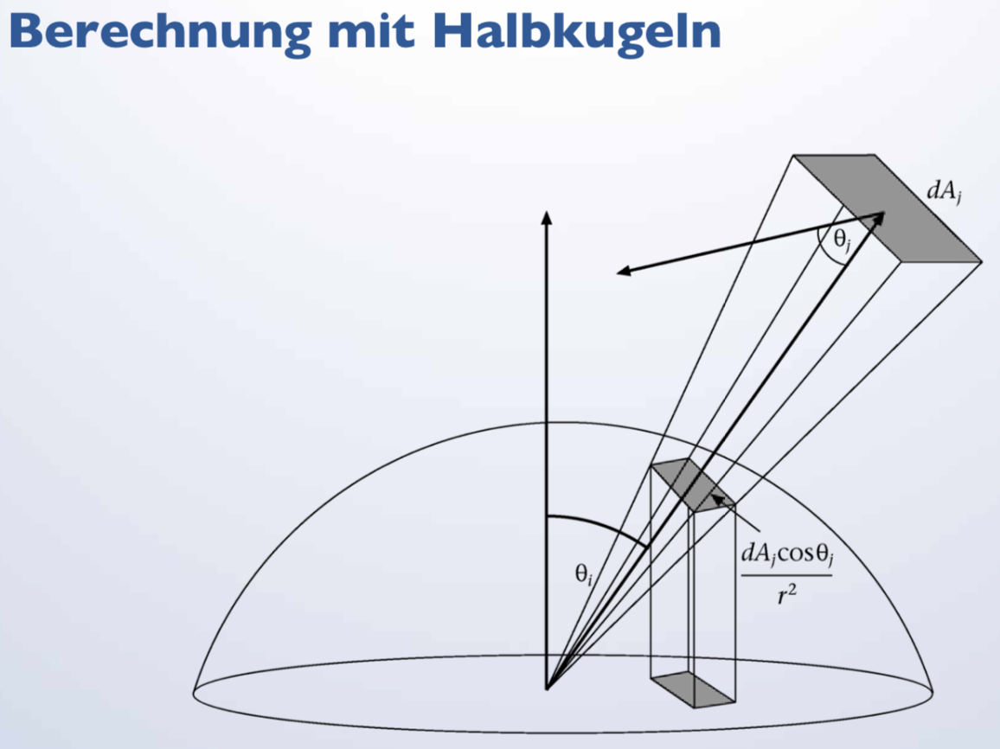

## Projektion auf Würfel
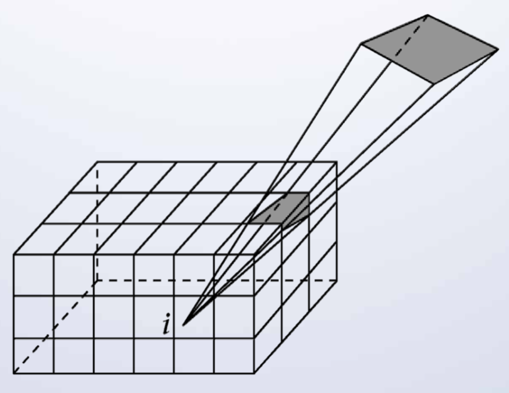

## Berechnung
* Progressive Radiosity: Berechnung und frühe Darstellung einer approximativen Lösung:
    * Wähle Patch j aus
    * Berechne Radiosity die von diesem Patch auf alle anderen Patches verteilt wird
    * Wiederhole das Ganze...
* Hierarchical Radiosity: Erhöhung der Anzahl Patches wo es notwendig ist

## Andere Lösungen der Rendering Equation
* Photon Mapping
* Monte Carlo Raytracing
